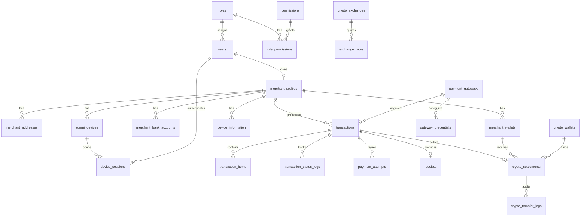
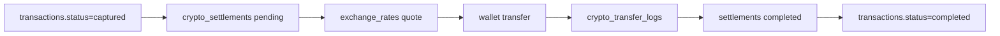

# CryptoPOS Database Architecture

PostgreSQL 17 (production) · SQLite supported for local boot · SQLAlchemy 2 models in `app/models`

## Design goals

- Support 100k+ merchants and millions of transactions without schema redesign
- 3NF normalization with controlled denormalization only where search/receipt latency requires it (e.g. `receipts.merchant_name`)
- Soft delete + audit columns on every table
- Append-only payment status history (`transaction_status_logs`) — never overwrite lifecycle history
- Gateway / exchange / wallet provider independence via reference tables + adapter configuration

## Normalization

| Domain | Approach |
|--------|----------|
| Identity | `users`, `roles`, `permissions`, `role_permissions` |
| Merchant | Profile split from addresses, wallets, bank accounts, devices |
| Payments | Transaction header + items + attempts + callbacks + immutable status logs |
| Settlement | Settlement row + transfer logs; rates stored historically in `exchange_rates` |
| Website CMS | Independent content tables consumed by `/website/*` APIs |
| Reference | `countries`, `currencies`, `languages` |

## Entity relationship overview

## Settlement data flow

## Critical indexes

| Table | Index purpose |
|-------|----------------|
| `users` | email, phone lookup |
| `merchant_profiles` | status, email |
| `transactions` | merchant_id, status, gateway_reference, merchant_reference, receipt_number, payment_date, composite `(merchant_id, status, payment_date)` |
| `merchant_wallets` | wallet_address |
| `crypto_settlements` | status, blockchain_tx_hash |
| `exchange_rates` | pair+provider, captured_at |
| `receipts` | receipt_number unique, transaction_id |
| `refresh_tokens` | jti unique |
| `sunmi_devices` | serial_number unique |

## Constraints

- UUID primary keys on all tables
- Soft delete via `deleted_at`
- Audit via `created_by` / `updated_by` (logical user references; no circular FK to `users`)
- CHECK: `transactions.amount > 0`, non-negative fees/tax, positive settlement USDT amount
- UNIQUE: merchant+merchant_reference, receipt_number, wallet address+network, IBAN

## Performance strategy

1. **Hot path indexes** on merchant/transaction/settlement lookups used by POS
2. **Partition readiness**: `transactions` and `transaction_status_logs` keyed by `payment_date` / `created_at` for future RANGE partitioning in PostgreSQL
3. **Append-only logs** avoid update contention on history tables
4. **Credential secrecy**: `gateway_credentials.encrypted_payload` stores ciphertext only — never plaintext secrets
5. **N+1 prevention**: repositories use `selectinload` for payment detail graphs

## Backup / recovery (production)

- Daily full + WAL / PITR on PostgreSQL
- Soft-deleted rows retained for audit until purge jobs run
- Settlement and payment callback payloads retained for dispute windows

## Local vs production

| Env | Engine | Notes |
|-----|--------|-------|
| Local boot | SQLite (`cryptopos.db`) | Portable UUID/JSON types |
| Production | PostgreSQL 17 | JSONB variant, connection pooling, partitioning |

## Model inventory

All tables from `DATABASE_ARCHITECTURE.md` are mapped under `app/models/`:

Identity · Merchants · Devices · Payments · Crypto/Settlement · Website CMS · Audit/Support · Reference data
